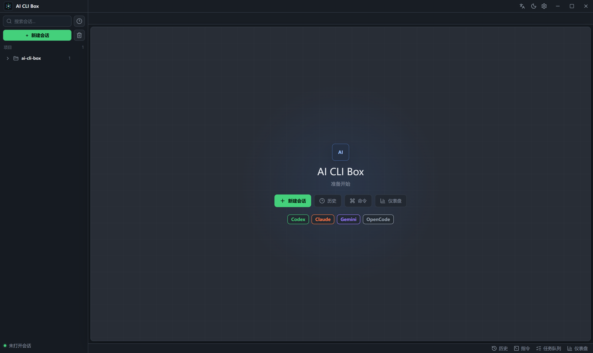
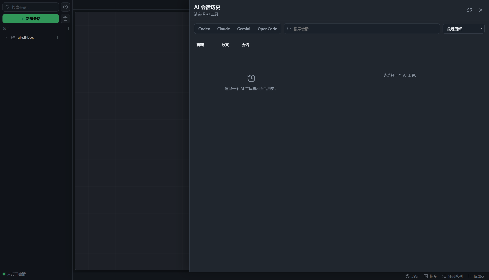
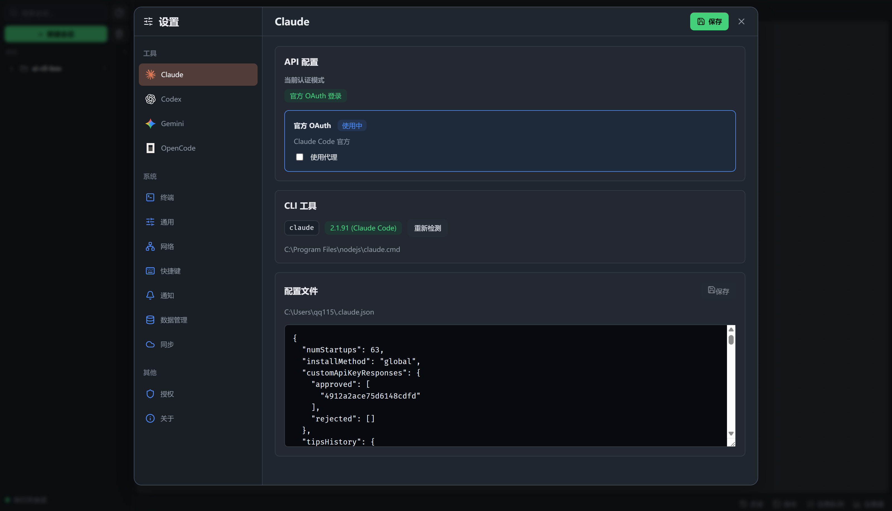
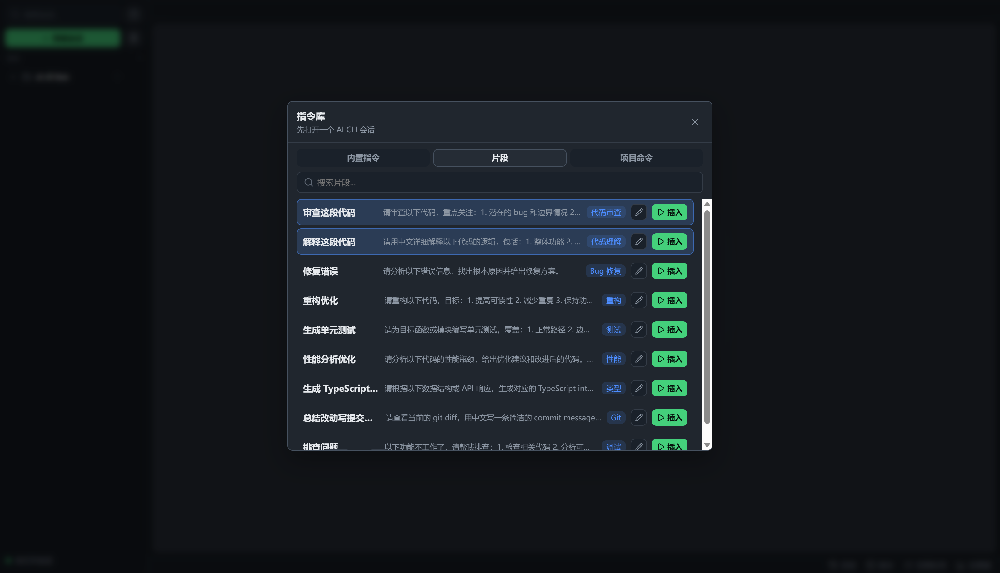
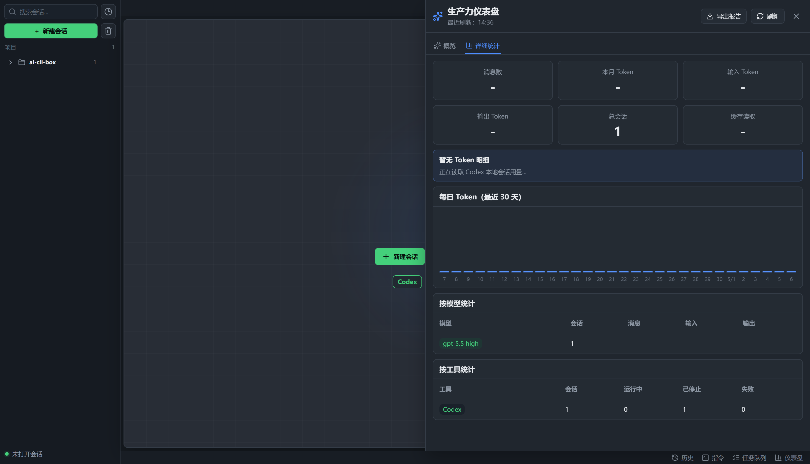

<div align="center">
  
  <h1 align="center">AI CLI Box</h1>


  <p><b>给 AI CLI 用户的轻量级桌面工作台</b> · 本地优先 · 多工具 · 多项目 · 可恢复</p>

  <p>
    <a href="https://github.com/Rhys0902/ai-cli-box/releases/latest"></a>
    <a href="https://github.com/Rhys0902/ai-cli-box/stargazers"></a>
    
    
    
    
    
  </p>

  <p>
    <a href="#-特性">特性</a> ·
    <a href="#-工作流一览">工作流一览</a> ·
    <a href="#-截图">截图</a> ·
    <a href="#-安装">安装</a> ·
    <a href="#-技术栈">技术栈</a> ·
    <a href="#-常见问题">常见问题</a>
  </p>
</div>

---

## ✨ 特性

- 🧠 **多 AI CLI 统一管理**：Codex、Claude Code、Gemini CLI、OpenCode 放在同一个窗口里使用
- 📁 **项目级会话组织**：会话按项目分组，多项目、多会话并行时不用再靠终端窗口标题找上下文
- 💻 **原生终端体验**：基于 xterm.js，保留 CLI 原本的交互方式，不接管模型响应
- 🕘 **AI 历史恢复**：集中读取本机 AI CLI 历史，支持按工具、全局项目和当前项目查看
- ⚡ **指令库与任务队列**：常用提示片段、项目命令和待办任务可以快速插入或排队发送
- 🚀 **轻量启动快**：打包产物 < 10MB，常驻运行内存通常 < 10MB，资源占用远低于 Electron 同类
- 📊 **生产力仪表盘**：查看会话数量、运行状态、任务和 本地 Token 用量趋势
- 🔒 **本地优先**：应用本身不提供云同步，不上传你的代码或会话内容
- 🔄 **自动更新**：支持启动检查、设置页手动检查和下载安装更新

## 🧰 工作流一览

> AI CLI Box 不替代任何 CLI。你仍然使用原来的账号、模型和配置；它负责把终端会话组织成更稳定的桌面工作流。

| 场景 | 能力 |
| --- | --- |
| 🧠 **AI 工具** | Codex · Claude Code · Gemini CLI · OpenCode |
| 📁 **项目管理** | 按项目收纳会话 · 多项目并行 · 会话重命名 · 权限切换 |
| 💻 **终端工作台** | PowerShell · cmd · zsh · bash · fish · 自定义 Shell |
| 🕘 **会话历史** | 全局历史 · 按项目筛选 · 搜索排序 · 恢复到新会话 / 当前终端 |
| ⚡ **指令库** | 内置指令 · 提示片段 · 项目命令 · 一键插入终端 |
| ✅ **任务队列** | 多条任务排队 · 逐条发送 · 状态管理 |
| 📊 **仪表盘** | 会话统计 · 任务统计 · Codex Token 趋势 |
| ⚙️ **设置中心** | CLI 检测 · 配置文件 · 网络代理 · 快捷键 · 通知 · 自动更新 |

## 📸 截图

<table>
  <tr>
    <td align="center" width="50%">
      
      <sub><b>工作台 · 项目分组、多会话和终端主工作区</b></sub>
    </td>
    <td align="center" width="50%">
      
      <sub><b>AI 会话历史 · 按工具和项目查看，选择后再展示详情</b></sub>
    </td>
  </tr>
  <tr>
    <td align="center" width="50%">
      
      <sub><b>设置中心 · CLI 检测、配置文件、代理和自动更新</b></sub>
    </td>
    <td align="center" width="50%">
      
      <sub><b>指令库 · 常用提示片段、项目命令和快速插入</b></sub>
    </td>
  </tr>
  <tr>
    <td colspan="2" align="center">
      
      <br />
      <sub><b>生产力仪表盘 · 会话状态、任务和 Codex 本地 Token 趋势</b></sub>
    </td>
  </tr>
</table>

## 🚀 安装

### 从 Release 下载（推荐）

到 [Releases](https://github.com/Rhys0902/ai-cli-box/releases/latest) 下载对应平台的安装包：

- **Windows**：优先下载 `.exe` 安装包；需要 MSI 部署时下载 `.msi`
- **macOS Apple Silicon**：下载 `darwin-aarch64.dmg`
- **macOS Intel**：下载 `darwin-x64.dmg`

安装后可以在设置页手动检查更新。应用启动时也会自动检查一次最新版本。

### 使用前准备

请先确保你需要的 AI CLI 已经能在本机终端中正常运行：

| 工具 | 命令 |
| --- | --- |
| Codex | `codex` |
| Claude Code | `claude` |
| Gemini CLI | `gemini` |
| OpenCode | `opencode` |

## 🧭 快速开始

1. 安装你需要的 AI CLI，例如 `codex`、`claude`、`gemini` 或 `opencode`
2. 下载并安装 AI CLI Box
3. 点击「新建会话」
4. 选择 AI 工具、项目目录、Shell 和运行权限
5. 创建会话，在内置终端中继续使用原来的 AI CLI

如果不填写会话名称，应用会根据项目目录自动生成名称。

## 🧱 技术栈

| 层 | 选型 |
| --- | --- |
| 桌面框架 | Tauri 2 |
| 前端 | React + Vite |
| 后端 | Rust |
| 终端 | xterm.js |
| 本地能力 | PTY · Shell · 会话历史 · 配置读写 · 系统托盘 · 自动更新 |

## 🔄 最近更新

- 新增自动更新能力，支持启动检查、设置页手动检查和下载安装
- 优化 AI 会话历史面板，支持按工具、全局项目和当前项目查看
- 新增项目会话右键菜单，支持重命名、权限切换、查看历史和删除
- 优化终端主题、滚动条贴合、右侧混排文本裁切和输入光标异常问题
- 优化设置页中的 CLI 检测、配置文件读取和 Windows 检测窗口体验
- 新增关闭窗口确认和系统托盘相关体验优化

## ❓ 常见问题

### 为什么新建会话后看起来像普通终端？

这是预期行为。AI CLI Box 的目标是管理 AI CLI 终端，而不是替代这些 CLI。会话启动后，本质上仍然运行 `codex`、`claude`、`gemini` 或 `opencode`。

### 为什么要选择 Shell？

不同用户的 AI CLI 可能安装在不同 Shell 环境中。例如 Windows 用户可能使用 PowerShell 7，macOS 用户可能使用 zsh。AI CLI Box 会通过你选择的 Shell 启动对应工具，尽量复用你本机已有的 PATH 和配置。

### 历史会话来自哪里？

历史会话来自本机对应 AI CLI 保存的数据。AI CLI Box 只读取并整理这些记录，继续会话时仍交给对应 CLI 自己恢复。

### 是否会上传我的代码或会话？

不会。AI CLI Box 本身是本地桌面应用，不提供云端同步服务。实际模型请求由你启动的 AI CLI 工具处理，请以对应 CLI 工具的账号、配置和隐私策略为准。

### macOS 提示应用无法打开怎么办？

如果 macOS 提示应用无法打开或需要开发者认证，可在终端执行下面命令移除隔离标记后再打开：

```bash
xattr -d com.apple.quarantine "/Applications/AI CLI Box.app"
```

## 💬 反馈

- Issue：[github.com/Rhys0902/ai-cli-box/issues](https://github.com/Rhys0902/ai-cli-box/issues)
- Releases：[github.com/Rhys0902/ai-cli-box/releases](https://github.com/Rhys0902/ai-cli-box/releases)

---

<div align="center">
  <sub>A local-first desktop workspace for Codex, Claude Code, Gemini CLI and OpenCode.</sub>
</div>
